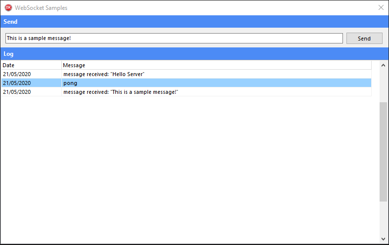

# websocket-server


This is a websocket server for Delphi.
 
## Prerequisites
 * `[Optional]` For ease I recommend using the Boss for installation
   * [**Boss**](https://github.com/HashLoad/boss) - Dependency Manager for Delphi
 
## Installation using Boss (dependency manager for Delphi applications)
```
boss install github.com/mateusvicente100/websocket-server
```

## Manual Installation
Add the following folder to your project, in *Project > Options > Resource Compiler > Directories and Conditionals > Include file search path*
```
../websocket-server/src
```

## Getting Started
You need to use WebSocket.Server
```pascal
uses WebSocket.Server;
```

Create an instance of TWebSocketServer and assign the methods and propertys
```pascal
proceudre StartServer;
var
  LServer: TWebSocketServer;
begin
  LServer := TWebSocketServer.Create;
  LServer.DefaultPort := 8080;
  LServer.OnExecute := OnExecute;
  LServer.OnConnect := OnConnect;
  LServer.OnDisconnect := OnDisconnect;
  LServer.Active := True;  
end;
```

## Samples
Check out our samples projects for the server and client side, with web and Delphi code. If you have any questions or suggestion, please contact, make your pull request or create an issue.

## Delphi Client


## Web Client

