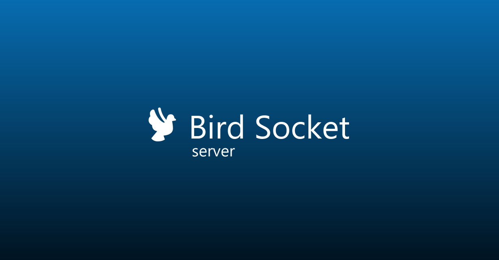
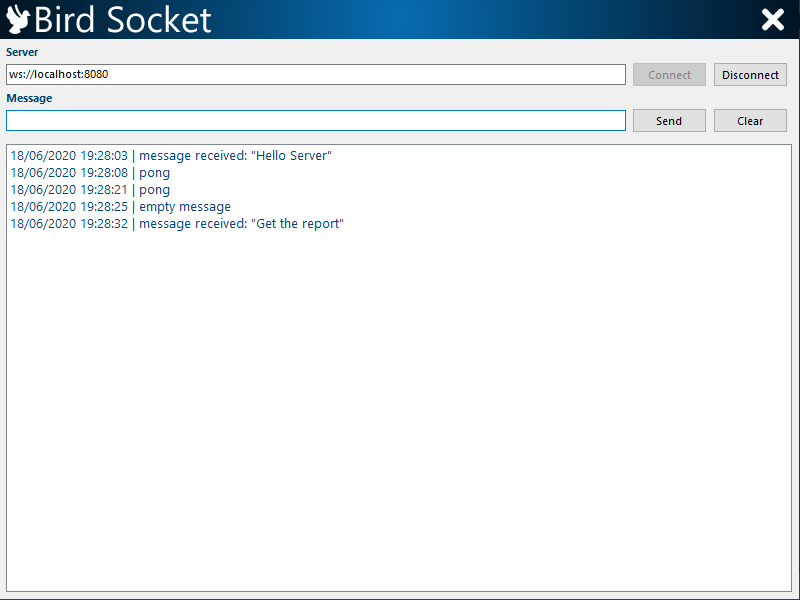
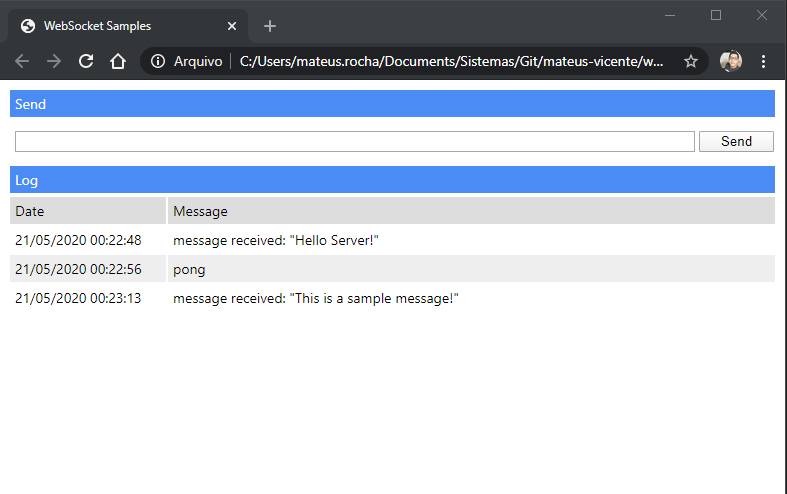

# Bird Socket Server

This is a websocket server for Delphi.


<p align="center">
    
</p>  

## Prerequisites

`[Optional]` For ease I recommend using the Boss for installation

* [**Boss**](https://github.com/HashLoad/boss) - Dependency Manager for Delphi

## Installation using Boss (dependency manager for Delphi applications)

```html
boss install github.com/mateusvicente100/bird-socket-server
```

## Manual Installation

Add the following folder to your project, in *Project > Options > Resource Compiler > Directories and Conditionals > Include file search path*

```html
../bird-socket-server/src
```

## Getting Started

You need to use Bird.Socket

```pascal
uses Bird.Socket;
```

Create an instance of TBirdSocket and assign the methods and propertys

```pascal
procedure
var
  LServer: TBirdSocket;
begin
  LServer := TBirdSocket.Create(8080);
  try
    LServer.AddEventListener(TEventType.CONNECT,
      procedure(const ABird: TBirdSocketConnection)
      begin
        // Do on connect.
      end);

    LServer.AddEventListener(TEventType.EXECUTE,
      procedure(const ABird: TBirdSocketConnection)
      begin
        // Do on execute.
      end);

    LServer.AddEventListener(TEventType.DISCONNECT,
      procedure(const ABird: TBirdSocketConnection)
      begin
        // Do on disconnect.
      end);
    LServer.Start;
  finally
    LServer.DisposeOf;
  end;
end;
```

## Samples

The bird socket can run in many Delphi way.

[**Console**](https://github.com/mateusvicente100/bird-socket-server/tree/master/samples/server/console) - Run a console application

[**ISAPI**](https://github.com/mateusvicente100/bird-socket-server/tree/master/samples/server/isapi) - Generate a ISAPI dll for IIS

[**VCL**](https://github.com/mateusvicente100/bird-socket-server/tree/master/samples/server/vcl) - Run a VCL application

[**Service**](https://github.com/mateusvicente100/bird-socket-server/tree/master/samples/server/service) - Run a windows service

## Delphi Client

For Delphi websocket connections I recommend to use the [**bird-socket-client**](https://github.com/mateusvicente100/bird-socket-client) project. It's simple to use and install

```pascal
procedure Start;
var
  LBirdSocket: TBirdSocketClient;
begin
  LBirdSocket := TBirdSocketClient.New('ws://localhost:8080');

  LBirdSocket.AddEventListener(TEventType.MESSAGE,
    procedure(const AText: string)
    begin
      Log(AText);
    end);

  LBirdSocket.Connect;
  LBirdSocket.Send('Hello Server');
end;
```

<p align="center">
    
</p>  

## Web Client

For web we have native websocket connection in html

```html
<script>
  const socket = new WebSocket('ws://localhost:8080');

  socket.addEventListener('message', function (event) {
    console.log(event.data);
  });

  socket.addEventListener('open', function (event) {
    socket.send('Hello Server!');
  });
</script>  
```

<p align="center">
  
</p>
